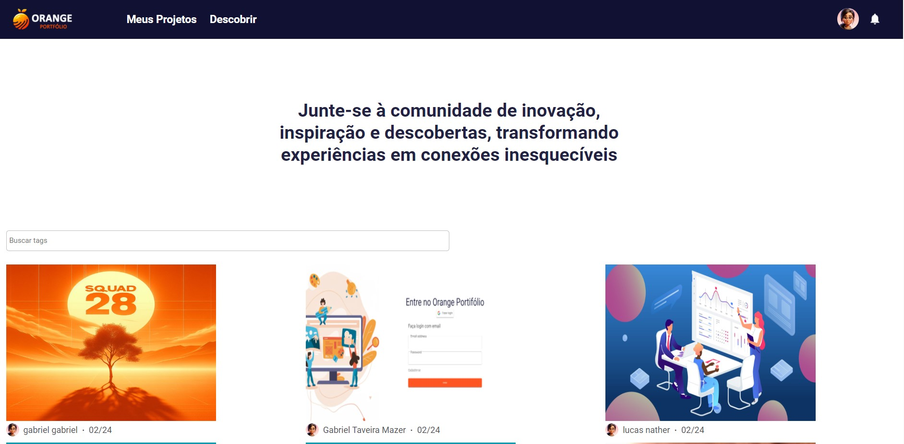
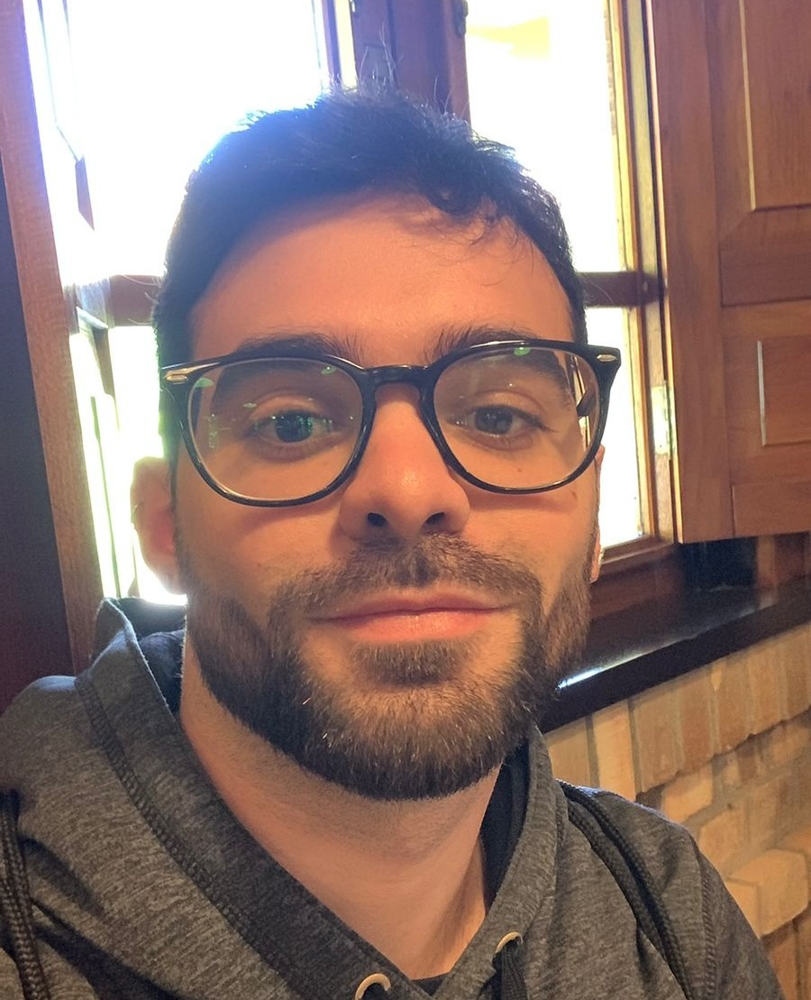

# Orange Portfólio - SQUAD 28

<h1 align="center">
    
</h1>

<ol>
    <li> <a href="#acesse">Acesse o Orange Portfólio do Squad 28</a></li>
    <li><a href="#sobre">Sobre</a></li>
    <li> <a href="#comorodaroprojeto">Como Rodar o Projeto localmente?</a> </li>
    <li> <a href="#conteudoxterno">Conteúdo externo</a></li>
    <li> <a href="#nossaequipe">Nossa Equipe</a></li>
</ol>

<h2 id="acesse">Acesse o Orange Portfólio do Squad 28</h2>

Acesse nossa aplicação em https://squad28hackaton2024.github.io/orange-juice-front-end/login/index.html

<h2 id="sobre">Sobre</h2> 

O Orange Portfólio foi um projeto desenvolvido pelo Squad 28 para o Hackathon do Programa de Formação da [Orange Juice](https://tech.orangejuice.com.br/programadeformacao). O objetivo desse projeto foi a construção de uma ferramenta em que desenvolvedores possam postar seu portfólio e se conectar entre si e com grandes empresas em busca de novos talentos.

<h2 id="comorodaroprojeto">Para rodar o projeto localmente</h2>

Acesse o repositório do [Back-End](https://github.com/squad28hackaton2024/orange-juice-back-end) e siga as instruções para rodar o servidor.

Você deverá clonar a **branch localhost** desse repositório com o seguinte comando: 
```bash
$ git clone -b localhost --single-branch https://github.com/squad28hackaton2024/orange-juice-front-end.git
```
As rotas foram pré-definidas como http://127.0.0.1:5500 e por isso instruímos o uso da extensão live server que faz uso da porta 5500. 

Depois que o back-end estiver rodando, abra o arquivo index.html com a extensão live server.

<h2 id="conteudoxterno">Conteúdo Externo</h2> 

* :wink: Verifique nosso [Pitch](https://youtu.be/taFYmRD8m3c)! 

* :yellow_heart: E também nosso [Vídeo de funcionalidades]().

<h2 id="nossaequipe">Nossa Equipe</h2> 


|:woman_cartwheeling:|Nome|*No Programa de Formação eu...*|Contatos|
|--|--|:--:|--|
|<br>| Anna Gabriela Mota | *"...Esses quinze dias foram incríveis, a cada dia enfrentamos um novo desafio e tivemos a oportunidade de aprender algo novo. O projeto do Orange Portfólio me permitiu aprimorar e colocar em prática minhas habilidades. O trabalho em equipe foi fundamental e juntos conseguimos alcançar um resultado que nos enche de orgulho."* | [Github](https://github.com/motaag) [Linkedin](https://www.linkedin.com/in/motaag) [Email](gabimotta40@gmail.com) |
| <br> | Gabriel Mazer | *"...O conhecimento adquirido ao longo do Hackaton é algo que vou levar para a vida intera, sendo o aprendizado de trabalhar em equipe o maior deles. Fiz novos amigos, assumi riscos e me dispus a aprender novas tecnolgias para superar esse desafio. Saio daqui com a certeza de ser o protagonista da minha história "* | [Github](https://github.com/gabrielmazer) [Linkedin](https://www.linkedin.com/in/gabrielmazer/) [Email](gabriel.mazer@outlook.com) |
| <br> | Lucas Nather | *"...Ás vezes a gente acha que nosso conhecimento não está ao nível de participar de um projeto como este, mas ao longo de 14 dias, com muita persistência, ajuda do nosso grupo/mentores, vemos que na verdade é possível sim. Aprendi muito na parte do Back-End, desde conseguir salvar imagens em nosso projeto até o deploy, na parte do Front-End, nunca subestime o CSS (kkkk) sempre tem alguma coisa que você nunca viu e com Javascript expandi ainda mais meu conhecimento para no futuro conseguir extrair mais da linguagem. Agradeço a todos que fizeram parte e ajudaram no nosso caminho do projeto!!!"* | [Github](https://github.com/lucasnather) [Linkedin](https://www.linkedin.com/in/lucas-nather-19990320b/) [Email](natherlucas@gmail.com) |


<hr>

<p> #FuturosSangueLaranja 🧡 <p>
